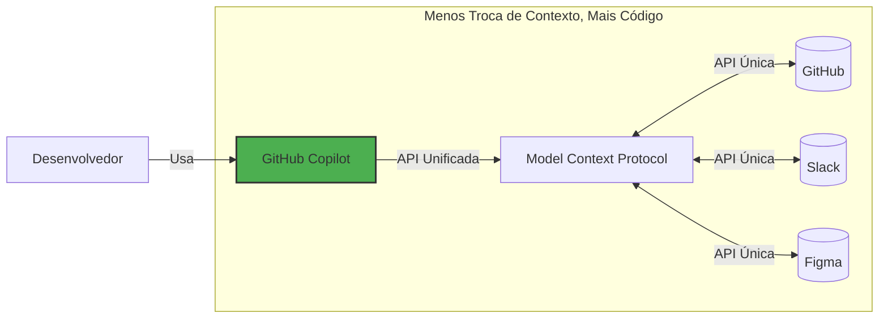

# Etapa 1: Introdução ao MCP e configuração do ambiente


No exercício [Getting Started with GitHub Copilot](https://github.com/skills/getting-started-with-github-copilot), fomos apresentados ao site de atividades extracurriculares da Escola Mergington High School, que permitia que os alunos se inscrevessem em eventos.

E agora temos um problema... mas um bom problema! Mais professores estão pedindo para usá-lo! 🎉

Nossos colegas professores têm muitas ideias, mas não conseguimos acompanhar todos os pedidos! 😮 Para resolver isso, vamos dar um upgrade no GitHub Copilot habilitando o **Model Context Protocol (MCP)**. Mais especificamente, vamos adicionar o **servidor MCP do GitHub**, que permitirá um fluxo combinado de **gestão de issues** e **atualizações no site**. 🧑‍🚀

Vamos começar!

---

## O que é o Model Context Protocol (MCP)?

O [Model Context Protocol (MCP)](https://modelcontextprotocol.io/introduction) é frequentemente chamado de **"USB-C para IA"** – um conector universal que permite ao GitHub Copilot (e outras ferramentas de IA) interagir facilmente com outros serviços.

Basicamente, é uma forma de descrever as capacidades e requisitos de um serviço, de forma que ferramentas de IA possam identificar quais métodos usar e quais parâmetros fornecer corretamente. Um servidor MCP fornece essa interface.



---

## :keyboard: Atividade: Conhecendo o ambiente

Antes de mergulhar no MCP, vamos iniciar nosso ambiente de desenvolvimento e relembrar o aplicativo de atividades extracurriculares.

1. Clique com o botão direito no botão abaixo para abrir a página **Create Codespace** em uma nova aba. Use a configuração padrão.

   [](https://codespaces.new/{{full_repo_name}}?quickstart=1)

2. Valide se as extensões **Copilot Chat** e **Python** estão instaladas e habilitadas.

   <br/>
   

3. Verifique se o aplicativo roda antes de modificá-lo. Na barra lateral esquerda, selecione a aba **Run and Debug** e pressione o ícone **Start Debugging**.

   <details>
   <summary>📸 Mostrar captura de tela</summary><br/>

   

   </details>

   <details>
   <summary>🤷 Com problemas?</summary><br/>

   Se a área de **Run and Debug** estiver vazia, tente recarregar o VS Code: Abra a paleta de comandos (`Ctrl`+`Shift`+`P`) e procure por `Developer: Reload Window`.

   

   </details>

4. Use a aba **Ports** para encontrar o endereço da página web, abra-o e verifique se está rodando.

   <details>
   <summary>📸 Mostrar captura de tela</summary><br/>

   

   

   </details>

---

## :keyboard: Atividade: Adicionar o servidor MCP do GitHub

1. Dentro do seu codespace, abra o painel **Copilot Chat** e verifique se o modo **Agent** está selecionado.

   

   <details>
   <summary>Modo Agent ausente?</summary><br/>

   - Verifique se o VS Code está na versão `v1.99.0` ou superior.
   - Verifique se a extensão do Copilot está na versão `v1.296.0` ou superior.
   - Confira se o modo Agent está habilitado nas [configurações de usuário ou workspace](https://code.visualstudio.com/docs/configure/settings#_workspace-settings).

      

   </details>

2. No seu codespace, navegue até a pasta `.vscode` e crie um arquivo chamado `mcp.json`. Cole o seguinte conteúdo:

   📄 **.vscode/mcp.json**

   ```json
   {
     "servers": {
       "github": {
         "type": "http",
         "url": "https://api.githubcopilot.com/mcp/"
       }
     }
   }
   ```

3. No arquivo `.vscode/mcp.json`, clique no botão **Start** e aceite o prompt para autenticar com o GitHub. Isso informou ao GitHub Copilot as capacidades do servidor MCP.

   

   <br/>

   

4. No painel lateral do Copilot, clique no ícone **🛠️** para mostrar as capacidades adicionais.

   

   

5. **Commit** e **push** o arquivo `.vscode/mcp.json` para a branch `main`.

   > 🪧 **Nota:** Fazer push direto para a branch `main` não é uma boa prática. Estamos fazendo isso apenas para simplificar este exercício.

6. Agora que sua configuração do servidor MCP foi enviada para o GitHub, a Mona já deve estar verificando seu trabalho. Aguarde um pouco e fique de olho nos comentários. Você verá ela respondendo com informações de progresso e a próxima lição.

> [!NOTE]
> Os próximos passos envolverão a criação de issues no GitHub. Se quiser evitar receber notificações por e-mail, você pode parar de seguir o repositório.

<details>
<summary>Com problemas?</summary><br/>

Certifique-se de que:

- Seu arquivo `.vscode/mcp.json` é semelhante ao exemplo fornecido.
- Você fez push das alterações para a branch `main`.

</details>
